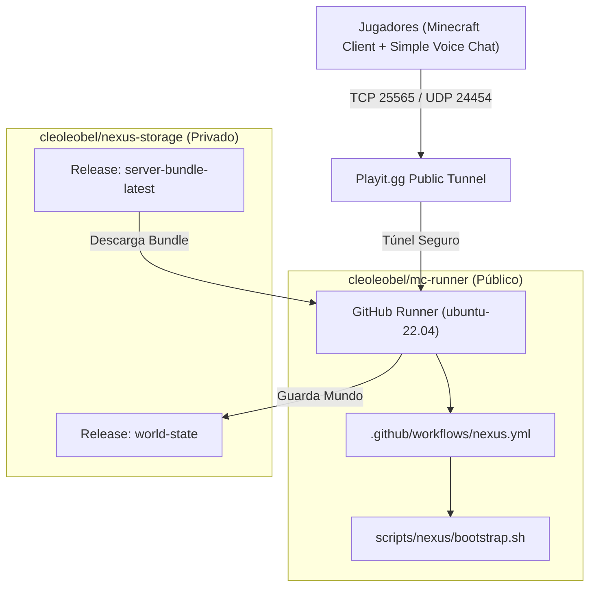

# Arquitectura de Despliegue NEXUS Java Server

## 1. Visión General y Principios de Diseño

La infraestructura de **NEXUS Dedicated Server** está diseñada bajo el principio de **desacoplamiento total** y **alta portabilidad**.

El objetivo es permitir la ejecución temporal del servidor Minecraft Java Forge 1.20.1 en entornos efímeros (como **GitHub Actions**) manteniendo la persisencia del estado de juego en un repositorio privado seguro, sin violar políticas de licencias ni exponer código sensible.

---

## 2. Separación de Responsabilidades (Dual Repository)

| Repositorio | Visibilidad | Función / Contenido |
|---|---|---|
| **NEXUS RUNNER** (`cleoleobel/mc-runner`) | **PÚBLICO** | Contiene únicamente scripts de orquestación, workflows YAML de Actions, documentación y herramientas de desarrollo. **No contiene binarios de mods ni archivos de mundo.** Coexiste pacíficamente con la infraestructura Bedrock (`servidor.yml`). |
| **NEXUS STORAGE** (`cleoleobel/nexus-storage`) | **PRIVADO** | Contiene la distribución inmutable empaquetada (`server-bundle.tar.gz`), los manifiestos con firmas SHA-256 (`manifest.json`, `checksums.sha256`), y el estado persistente del mundo (`world-current.tar.gz`, `world-previous.tar.gz`, backups históricos). |

---

## 3. Estrategia de Persistencia Anti-Pérdida de Mundo

El almacenamiento del mundo implementa un protocolo atómico en 9 pasos para evitar corrupción o pérdida accidental:

1. **Stop Limpio:** Se envía `save-all` y `stop` a través del FIFO de entrada del servidor.
2. **Cierre de Proceso:** Se espera a que el proceso Java termine y libere los descriptores de archivo.
3. **Sync de Disco:** Se ejecuta el comando POSIX `sync` para vaciar los buffers de sistema de archivos.
4. **Compresión Aislada:** Se comprime el directorio `./world` en `backups_staging/new-world-staging.tar.gz`.
5. **Verificación de Integridad:** Se comprueba el archivo `.tar.gz` mediante `tar -tzf`. Si falla, se aborta la subida.
6. **Firma Criptográfica:** Se calcula el SHA-256 del nuevo backup.
7. **Rotación Previas:** Se descarga el `world-current.tar.gz` remoto y se reposiciona como `world-previous.tar.gz`.
8. **Subida Criptográfica:** Se sube `world-current.tar.gz` e histórico a la release `world-state`.
9. **Verificación Remota:** Se valida la presencia y el tamaño del archivo subido antes de dar la tarea por concluida.

---

## 4. Abstracción de Red

Toda la lógica de comunicación exterior reside en `scripts/network/playit.sh`. Forge no conoce los detalles de la infraestructura de red.

- **Minecraft Java:** TCP `25565`
- **Simple Voice Chat:** UDP `24454`

Si en el futuro el servidor se migra a **Oracle Cloud A1**, **Tailscale**, **ZeroTier** o una IP Pública directa, solo se debe modificar o sustituir `scripts/network/playit.sh` sin alterar el flujo de arranque de Forge.
