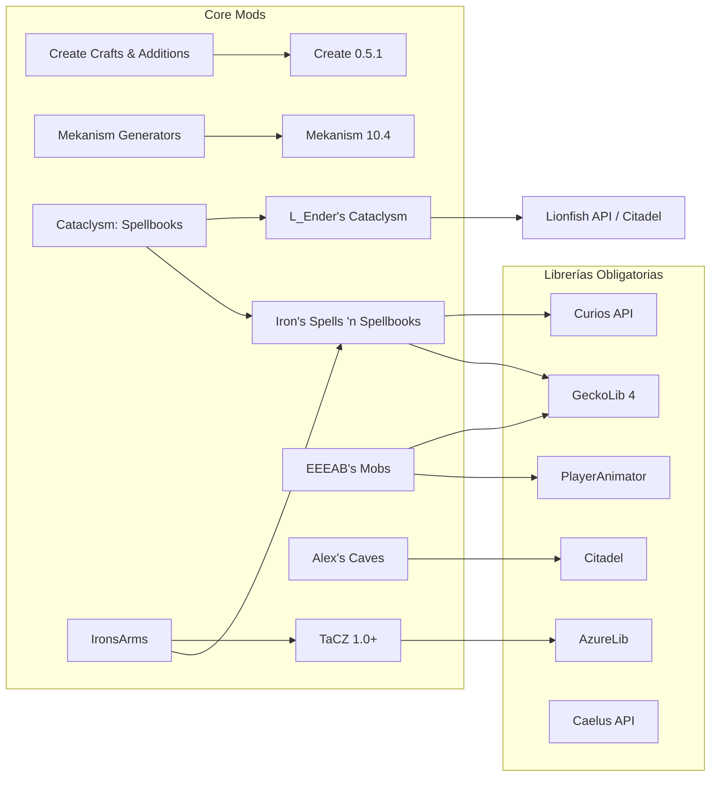

# GRAFO DE DEPENDENCIAS OBLIGATORIAS — NEXUS 1.20.1 FORGE

## TABLA DETALLADA DE DEPENDENCIAS

| Mod Consumidor | Dependencia Exigida | Versión Requerida | Justificación Téleologica |
|---|---|---|---|
| Alex's Caves | Citadel | >= 2.4.0 | Motor de renderizado de entidades y animaciones geológicas |
| L_Ender's Cataclysm | Lionfish API / Citadel | Latest 1.20.1 | Manejo de boss hitboxes y shaders de combate |
| Iron's Spells 'n Spellbooks | Curios API | Latest 1.20.1 | Slots de accesorios para spellbooks, anillos y capas |
| Iron's Spells 'n Spellbooks | GeckoLib | >= 4.2 | Animaciones 3D de hechizaciones y báculos |
| EEEAB's Mobs | GeckoLib & PlayerAnimator | Latest 1.20.1 | Animaciones complejas de ataques de bosses |
| TaCZ | AzureLib | Latest 1.20.1 | Motor de animación y física de armas de fuego |
